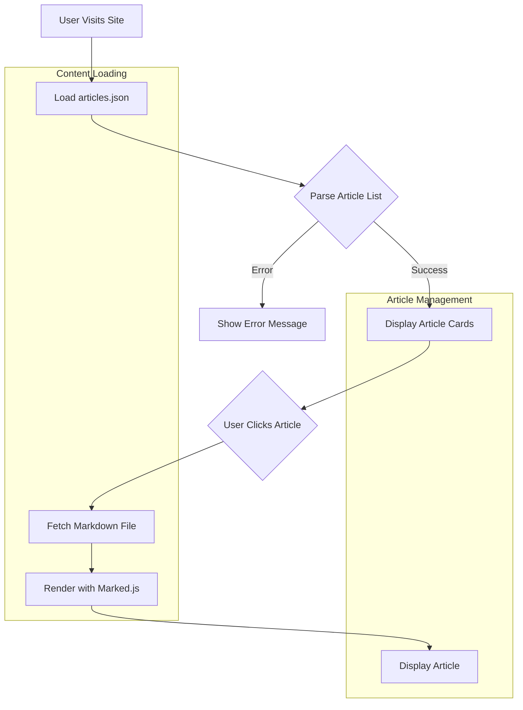

# Personal Articles Site

A clean, minimalist article publishing platform built with vanilla JavaScript and served via GitHub Pages.

## What This Does

This site presents written articles in a distraction-free reading experience with dark mode support. Articles are written in Markdown format and automatically rendered with proper typography and formatting. The system handles article metadata, reading time calculations, and provides a responsive design that works across all devices.

## Quick Start

**To view the site:** Visit [https://wryan14.github.io/](https://wryan14.github.io/)

**To add a new article:**
1. Create a new `.md` file in the repository root
2. Add an entry to `articles.json` with title, date, description, and file path
3. Commit and push changes - GitHub Pages will automatically update

**To run locally:**
```bash
python3 -m http.server 8000
# Visit http://localhost:8000
```

## System Flow

The site operates as a single-page application that dynamically loads article content.



**Key Points:**
- Articles load dynamically without page refreshes
- Markdown rendering happens client-side for fast performance
- Failed article loads display graceful error messages

## Technical Overview

Static site with client-side rendering for optimal GitHub Pages performance.

**Technology Stack:** HTML5, Vanilla JavaScript, Marked.js for Markdown
**Hosting:** GitHub Pages (automatic deployment from main branch)
**Dependencies:** Marked.js (CDN-loaded for Markdown parsing)
**Theme Support:** Light/Dark mode with localStorage persistence

## Article Structure

**articles.json Format:**
```json
{
  "title": "Article Title",
  "date": "2025-09-01",
  "description": "Brief description for preview",
  "tags": ["topic1", "topic2"],
  "path": "filename.md"
}
```

**Key Files:**
- `index.html`: Single-page application shell
- `articles.json`: Article metadata and configuration
- `*.md`: Individual article content files

## Features

- **Reading Progress Bar:** Visual indicator for article scroll position
- **Dark Mode:** Toggle between light and dark themes
- **Reading Time:** Automatic calculation based on word count
- **Responsive Design:** Optimized for desktop and mobile viewing
- **Typography:** Georgia serif font for optimal readability

## Documentation

- **Article Format:** Markdown files support standard GFM syntax
- **Metadata:** Articles.json controls article listing and metadata
- **Deployment:** Automatic via GitHub Pages on push to main branch

## Contact

GitHub Issues - For bug reports or feature requests